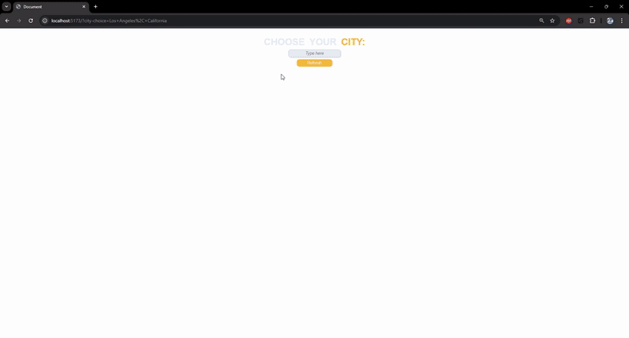

# Weather Data Visualization Project 🌤️

## Introduction
This project is a **weather data visualization application** that allows users to search for a city and display **real-time weather information**. It integrates multiple APIs to provide a rich user experience, including weather data, city images, and interactive charts.

## Features ✨
- **City Search Bar**: Enter a city name to retrieve its weather information.
- **Weather Data Display**: Uses the **OpenWeatherMap API** to fetch and display real-time temperature, humidity, and weather conditions.
- **Dynamic Background Image**: Fetches a city image from the **Unsplash API** and sets it as the background.
- **Temperature Charts**: Uses **Chart.js** to create interactive graphs showing temperature trends.
- **Fast Development with Vite**: The project is built with **Vite** for a fast and efficient development environment.

## DEMO 🎥

 <br>

## Technologies Used 🛠️
- **Vite** – Ultra-fast frontend development environment.
- **OpenWeatherMap API** – Fetches real-time weather data.
- **Unsplash API** – Retrieves city images dynamically.
- **Chart.js** – Displays interactive temperature charts.
- **HTML, CSS, JavaScript** – Core technologies for building the interface.

## How It Works ⚙️
1. **Enter a city name** in the search bar.
2. The app **fetches weather data** from OpenWeatherMap.
3. The **background image updates** dynamically using Unsplash.
4. A **temperature trend chart** is generated using Chart.js.

## Installation & Setup 🚀
1. **Clone the repository**
   ```sh
   git clone https://github.com/YOUR_USERNAME/weather-app.git
   cd weather-app
2. **Install dependencies**
   ```sh
   npm install
3. **Run the app with vite**
   ```sh
   npm run dev
4. **Open the local development server in your browser.**

## API Configuration 🔑
1. **Get an OpenWeatherMap API key** [here](https://openweathermap.org/api)
2. **Get an Unsplash API key** [here](https://unsplash.com/developers)
3. Create a `.env` file and add:
   ```env
   VITE_WEATHER_API_KEY=your_openweathermap_api_key
   VITE_UNSPLASH_API_KEY=your_unsplash_api_key

## Possible Improvements 🔮
- Add **forecast data** for multiple days.
- Implement a **dark mode toggle**.
- Support for **multiple languages**.
- Enhance UI/UX with additional animations.

---

This project has helped me improve my skills in **API integration, frontend application, and data visualization**. 🚀
